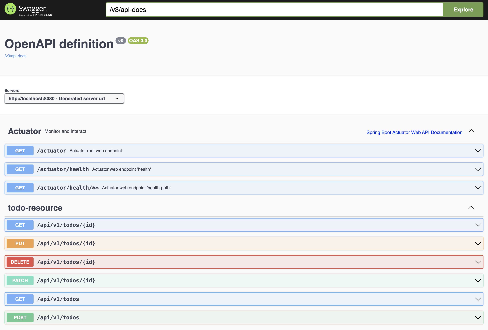

== Spring Boot Todo List backend application

A Spring Boot Todo list backend application that uses PostgreSQL as database server.

This is a simple backend application developed to learn how to:

- Develop a Rest API resource exposing a Todo resource.
- Develop testcases using test containers.
- How to use Spring Boot with a PostgreSQL Database using Hibernate.
- Containerize a Spring Boot microservice.
- How to deploy it on a container orchestrator as OpenShift.
- How to prepare it to be accessed from a frontend application developed with React.

This API is the backend of https://github.com/yborgess-pet-projects/react-todo-list.git[react-todo-list]

=== Basic requirements
- Requirements:
  - JDK 17+
  - Apache Maven 3.9.5+
  - A Container Engine, e.g. [podman](https://podman.io/)
  - A tool to interact with HTTP API exposed by this application, e.g. [httpie](https://httpie.io/)

== How to run it locally

1. Launch the database using a container engine that understand docker compose files:
+
[source]
----
$ podman compose -f ./deployment/container/postgresql.yml up -d
----
+
2. Build the project and launch the application using Spring Boot maven plugin:
+
[source]
----
$ mvn test spring-boot:run
----
+
3. List all the todos:
+
[source]
----
$ http :8080/api/v1/todos
HTTP/1.1 200
Connection: keep-alive
Content-Type: application/json
Date: Sun, 19 Nov 2023 18:45:13 GMT
Keep-Alive: timeout=60
Transfer-Encoding: chunked
Vary: Origin
Vary: Access-Control-Request-Method
Vary: Access-Control-Request-Headers

[
    {
        "completed": false,
        "id": 1,
        "title": "Buy tickets for the concert"
    },
    {
        "completed": true,
        "id": 2,
        "title": "Learn how to make a cheesecake"
    },
    {
        "completed": false,
        "id": 3,
        "title": "Replace the bicycle light batteries"
    }
]
----
+
These are the available endpoints for the Todo resource:
+

+
You can check the OpenAPI and Swagger resources to get more information about how to use the API. These resources are only activated for the default (dev) profile:
+
[source]
----
 http://localhost:8080/v3/api-docs -> OpenApi documentation
 http://localhost:8080/swagger-ui.html -> Swagger UI
----
+
4. To stop the application, use CTLR+C
5. To stop the database remove its container and network use the following:
+
[source]
----
$ podman compose -f ./deployment/container/postgresql.yml down
----

== How to run it as a container

1. Build the project with the `build-image` goal and specify the name of the final image based on your container registry preference:
+
[source]
----
$ mvn clean spring-boot:build-image -Dspring-boot.build-image.imageName=quay.io/yborgess/todo-list-spring-boot-backend
----
+
2. Launch the application and database using the compose files shipped with this repository:
+
[source]
----
$ podman compose \
  -f ./deployment/container/postgresql.yml \
  -f ./deployment/container/todo-list-app.yml \
  up
----
+
This time the application will be launched by default with the "prod" profile. The Spring Boot application will not populate the database with initial data. Execute the following command to add a new todo:
+
[source]
----
$ http POST :8080/api/v1/todos title="Read Spring Boot documentation"
----
+
3. To stop the database and application containers:
+
[source]
----
$ podman compose \
  -f ./deployment/container/postgresql.yml \
  -f ./deployment/container/todo-list-app.yml \
  down
----

== How to run it on OpenShift

1. Apply the following resource:
+
[source]
----
$ oc apply -f ./deployment/openshift/deployment.yml
deployment.apps/todo-list-postgresql created
service/todo-list-database-svc created
persistentvolumeclaim/todo-list-database-pvc created
deployment.apps/todo-list-backend-deployment created
service/todo-list-backend-svc created
secret/todo-list-secret configured
----
+
It launches the PostgreSQL database and two application replicas:
+
[source]
----
$ oc get pods
NAME                                           READY   STATUS    RESTARTS   AGE
todo-list-backend-deployment-d745566c6-fz6mf   1/1     Running   0          54s
todo-list-backend-deployment-d745566c6-gdtlc   1/1     Running   0          54s
todo-list-postgresql-6dd7d8d74b-pfz74          1/1     Running   0          55s
----
+
The application is deployed using the prod profile, and it is not exposed to the outside. You can use the frontend application to interact with it.

=== Cleanup the resources
To delete all the resources created by the backend, execute the folloing:

[source]
----
$ oc delete all -l tier=backend
----

The database uses a persistent storage that must be deleted explicitly:

[source]
----
$ oc delete pvc/todo-list-database-pvc
----
